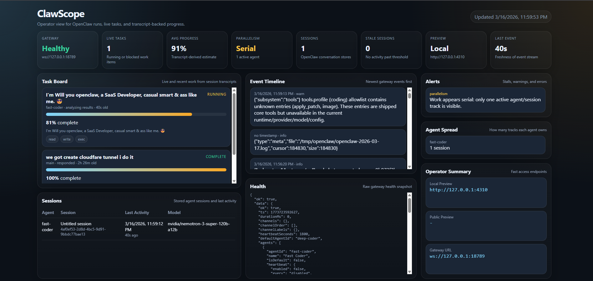

# Clawforge SaaS Starter

Public-safe OpenClaw starter for AI SaaS work on NVIDIA-hosted models.

Maintained by [Autopilot AI Tech](https://github.com/autopilotaitech)  
Website: [autopilotaitech.com](https://autopilotaitech.com)

If this starter saves you time, leave a tip here: [](https://buy.stripe.com/cNi28q3bZ4Vf3gpdXoenS03)

## Acknowledgements

Special thanks to [Peter Steinberger](https://x.com/steipete) and [NVIDIA AI](https://x.com/NVIDIAAI) for the technology, ideas, and open ecosystem work that helped make this starter possible.

What this repo does:

- runs OpenClaw in Docker
- uses NVIDIA's hosted API models instead of local GPU inference
- keeps the entire repo mounted into the container as a single shared mount at `/share`
- includes local skills for audit-first wiring, architecture, and enterprise SaaS delivery
- includes starter prompts for auditing, planning, fixing, and architecture work

## NVIDIA integration

This starter is built around the newer NVIDIA-hosted coding stack rather than a generic OpenClaw setup.

What was incorporated:

- NVIDIA API Catalog / `build.nvidia.com` as the model backend
- `nvidia/nemotron-3-super-120b-a12b` as the default deep reasoning model
- `moonshotai/kimi-k2-instruct-0905` as the faster implementation model
- `openai/gpt-oss-20b` as a lightweight fallback and repo-ops model

Why this matters:

- no local GPU hosting burden
- free prototyping path through NVIDIA's hosted API access
- stronger fit for coding, planning, agentic execution, and multi-step SaaS work
- better separation between deep architecture tasks and faster implementation loops

How it is wired:

- the OpenClaw bootstrap script configures the NVIDIA provider automatically
- `deep-coder` defaults to Nemotron 3 Super
- `fast-coder` uses Kimi K2
- `repo-ops` uses GPT-OSS 20B
- all three are available through the same NVIDIA-backed OpenClaw config
- for NVIDIA-hosted NVIDIA models, the starter keeps the provider-side model id as `nvidia/nemotron-3-super-120b-a12b` but maps the OpenClaw-selected ref to `nvidia/nvidia/nemotron-3-super-120b-a12b` so Nemotron does not 404 and fall back to Kimi

What this repo does not include:

- personal API keys
- your local drive letters
- your existing project repos
- private tokens or OpenClaw state

## Public Repo Notes

This repo is meant to be public-safe.

- `.env` is local-only and must not be committed
- `upstream/` is fetched during setup and is not committed
- `vendor/superpowers` and `vendor/context-hub` are fetched during setup and are not committed
- `projects/*` is ignored so your actual app repos stay local
- `OPENCLAW_LOCAL_CONTROL_UI_RELAXED=true` is the local-dev default so the Control UI works on localhost without pairing. Do not use that setting on a VPS/public deployment without replacing it with proper auth hardening.

Public defaults live in `.env.example`.

Local machine overrides belong in `.env`. For example:

```text
OPENCLAW_IMAGE=openclaw-local:latest
```

That local override is not the public default and should not be documented as required for other users.

## Stack

- OpenClaw
- Docker Compose
- NVIDIA API Catalog / build.nvidia.com
- Nemotron 3 Super
- Kimi K2 Instruct
- GPT-OSS 20B
- optional Cloudflare tunnel for preview apps
- ClawScope operator dashboard for background activity and stall detection
- optional Linuxbrew for skill dependencies

## Security defaults

This starter now defaults to the safer baseline we could apply without breaking normal local use:

- token auth enabled on the OpenClaw gateway
- auth rate limiting enabled
- no `allowInsecureAuth`
- no `dangerouslyDisableDeviceAuth` in the starter bootstrap
- Docker named volumes for OpenClaw state instead of a world-writable Windows host mount

The live stack used during development may still carry temporary local-only break-glass settings for browser pairing. Those are not the public default in this starter.

## Local Dev Warning

This repo is a local development starter, not a hardened internet-facing deployment.

Do not copy this setup to a VPS and expose it to the public internet without hardening it first.

Minimum things to fix before any public exposure:

- do not use break-glass Control UI auth flags
- use real HTTPS and a trusted reverse proxy
- lock down gateway auth and rate limiting
- review model/tool exposure for untrusted input
- harden filesystem permissions for OpenClaw state
- restrict origin/access instead of assuming localhost-style trust

If you want a VPS-safe deployment, treat this repo as a starting point only and harden it before exposing it.

## Repo layout

- `projects/` -> clone or copy the app you want OpenClaw to work on
- `prompts/` -> starter prompts for common AI SaaS workflows
- `skills/` -> local workspace skills included in this starter
- `vendor/` -> external skill repos cloned by the helper script
- `scripts/` -> setup and run helpers

## First-time setup

Clone the repo and move into it:

```powershell
git clone https://github.com/autopilotaitech/clawforge-saas-starter.git
Set-Location .\clawforge-saas-starter
```

Prepare local files:

```powershell
.\scripts\prepare-host.ps1
```

Edit `.env` and set `NVIDIA_API_KEY`.

The starter pins OpenClaw source to a stable upstream tag by default:

```text
OPENCLAW_GIT_REF=v2026.3.13-1
```

Override that only if you intentionally want to test a newer upstream snapshot.

Fetch OpenClaw source and the extra skill repos:

```powershell
.\scripts\fetch-openclaw.ps1
.\scripts\fetch-skill-repos.ps1
```

Build the local image:

```powershell
.\scripts\build-image.ps1
```

Linuxbrew is installed automatically during bootstrap so skill installers like `brew` are available without a separate manual step.

If you ever need to repair or refresh the Linuxbrew install manually:

```powershell
.\scripts\install-homebrew.ps1
```

Bootstrap the OpenClaw config:

```powershell
.\scripts\bootstrap-openclaw.ps1
```

Start the stack:

```powershell
.\scripts\start-stack.ps1
```

Start only the monitor:

```powershell
.\scripts\start-monitor.ps1
```

Attach the monitor to an already-running OpenClaw gateway without starting the starter stack:

```powershell
.\scripts\start-live-monitor.ps1
```

Show the tokenized dashboard URL:

```powershell
.\scripts\dashboard-url.ps1
```

Show the ClawScope operator URL:

```powershell
.\scripts\monitor-url.ps1
```

## Working model

Keep the starter repo mounted as `/share`.

Put real app repos under:

```text
projects/<your-repo>
```

Examples:

- `projects/arcline.pro-master`
- `projects/my-saas-app`

That keeps everything visible on the host while still using one mount only.

## Preview apps

Generated apps should listen on `APP_PREVIEW_PORT`, which defaults to `4310`.

Start a free Quick Tunnel:

```powershell
.\scripts\start-preview-tunnel.ps1
.\scripts\preview-url.ps1
```

For a stable hostname, set `CLOUDFLARE_TUNNEL_TOKEN` in `.env` and use:

```powershell
.\scripts\start-named-tunnel.ps1
```

## ClawScope

ClawScope is a lightweight command-center layer included in this starter.



It polls OpenClaw's real CLI surfaces and gives you:

- gateway health
- active sessions
- stale-session detection
- recent error signal
- event timeline from recent gateway logs
- local/public preview URL visibility

It is intentionally read-only. It does not drive OpenClaw or mutate state.

If you already have an OpenClaw gateway running elsewhere on the same machine and do not want to restart it, use `start-live-monitor.ps1`. That mode reads from the existing `openclaw-gateway` Docker container and serves ClawScope on `http://127.0.0.1:18880/`.

## Included skills

- `task-execution-guardrails`
- `autonomous-saas-delivery`
- `wiring-audit`
- `principal-architect`

External skill repos expected by bootstrap:

- `vendor/superpowers`
- `vendor/context-hub`

They are fetched by setup scripts and intentionally not committed into the public repo by default.

## Included prompts

- `prompts/01-beta-audit.md`
- `prompts/02-implementation-plan.md`
- `prompts/03-single-fix.md`
- `prompts/04-wiring-audit.md`
- `prompts/05-principal-architecture.md`

## Useful commands

```powershell
.\scripts\start-shell.ps1
.\scripts\attach-shell.ps1
.\scripts\start-gateway.ps1
.\scripts\models-status.ps1
.\scripts\stop-stack.ps1
docker compose ps
docker compose logs -f openclaw-gateway
```

## Project links

- GitHub org: [github.com/autopilotaitech](https://github.com/autopilotaitech)
- Website: [autopilotaitech.com](https://autopilotaitech.com)
- Support: [buy.stripe.com/cNi28q3bZ4Vf3gpdXoenS03](https://buy.stripe.com/cNi28q3bZ4Vf3gpdXoenS03)

## License

This project is released under the MIT License. See `LICENSE`.
